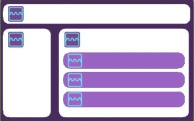
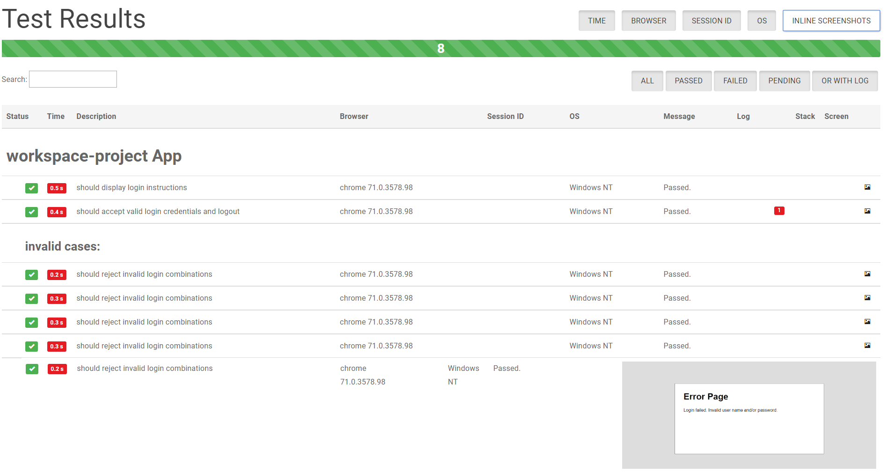
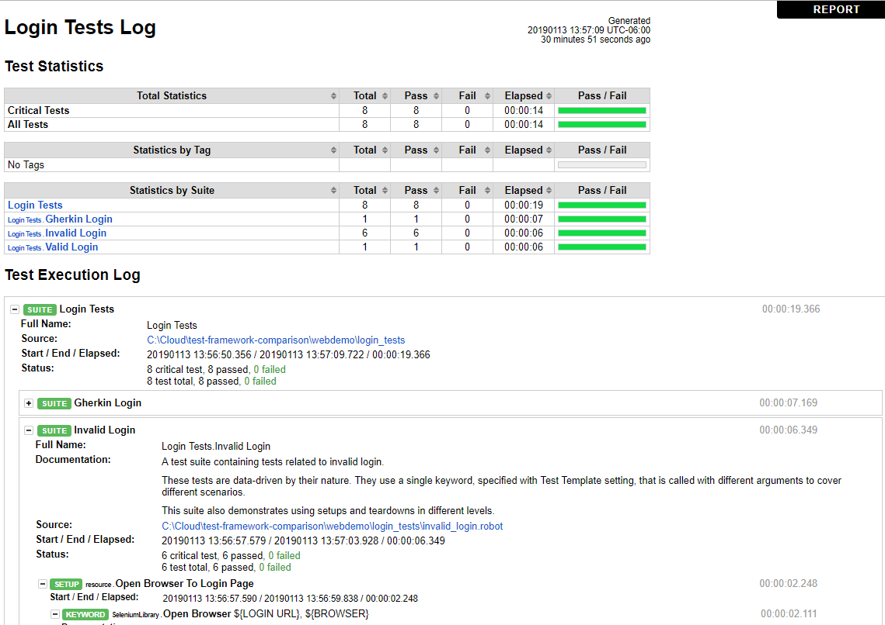

These are the technical opinions that came about while studying RobotFramework and comparing it to Angular's default test automation framework Protractor.

They can be grouped under 3 topics.

1. Use of design patterns in development
2. Asynchronous test execution
3. Other (community support, reports, debugging etc.)
_____

## 1. Use of design patterns in test development

- For RobotFramework, utilizing the page object pattern, or any complex development, relies on using Python.

### Why do page objects matter?

An incredible design practice when used correctly, Page Objects allow us to write reusable code in small chunks. We began baking the Page Object Pattern into BOIC a few months ago, and it has already paid off in spades: 

- Maintenance workload is greatly reduced

- Velocity of writing new tests is increased

- Bugs in both the tests and the application are detected and diagnosed faster

You can read about how we integrated this pattern at Siemens [here](https://wiki.siemens.com/display/en/Protractor+Best+Practices?flashId=-1012803651), and a more detailed explanation of Page Objects [here](https://martinfowler.com/bliki/PageObject.html#footnote-panel-object). Naturally, we need to utilize this feature (among many others) in Robot Framework. Here are our findings:

1. NCBI has a nice looking [page objects library](https://github.com/ncbi/robotframework-pageobjects) for Robot, **but it is unsupported.**

    > NOTE: Though support was never guaranteed, NCBI is no longer able to maintain this project.
    > We've moved off of Robot Framework due to lack of timely Python3 support in Robot Framework 
    > and the fact that the majority of our developers/test-writers prefer to write tests in Python. 
    > You are free to either fork the project to address any issues or to adopt the project. 
    > Please comment on this issue if you'd like to adopt it."

  1. [This website](http://seleniummaster.com/sitecontent/index.php/selenium-robot-framework-menu/selenium-robot-framework-python-menu/193-page-object-model-in-selenium-robot-framework-python) looks like it was written a decade ago

  2. Here is a [more recent write up](https://agiletoolsmith.wordpress.com/2016/05/22/robot-framework-page-objects/) on how to use page objects with RobotFramework, but in the context of migrating to Robot instead of another more modern framework, it raises more questions than answers.

To elaborate on point #3, the idea behind using Robot Framework is to create our own [domain specific language (DSL)](https://en.wikipedia.org/wiki/Domain-specific_language) from scratch using words that non-programmers can understand. No matter what framework or language we use, the underlying problems we are trying to solve remain the same:

* *How do we utilize page objects and organize our selectors?*

* *How do we make our tests agile enough, in small increments, to respond quickly to future decisions?*
    
To illustrate these shared problems between frameworks, take the author's code for a login page object, written in Python, as an example:
```python
from PageObjectLibrary import PageObject
from robot.libraries.BuiltIn import BuiltIn

class LoginPage(PageObject):
    PAGE_TITLE = "Login - PageObjectLibrary Demo"
    PAGE_URL = "/"

    _locators = {
        "username": "id=id_username",
        "password": "id=id_password",
        "submit_button": "id=id_submit",
    }

    def login_as_a_normal_user(self):
        username = BuiltIn().get_variable_value("${USERNAME}"}
        password = BuiltIn().get_variable_value("${PASSWORD}"}
        self.se2lib.input_text(self.locator.username, username)
        self.se2lib.input_text(self.locator.password, password)

        with self._wait_for_page_refresh():
            self.click_the_submit_button()
```
Now compare this to **our** login page object, written in Typescript:
```typescript
import { browser, by, element } from 'protractor';

export class LoginPage {
  usernameField = element(by.id('username_field'));
  passwordField = element(by.id('password_field'));
  loginDescription = element(by.id('login-message'));
  loginButton = element(by.id('login_button'));

  navigateTo() {
    return browser.get('/');
  }

  getParagraphText() {
    return this.loginDescription.getText();
  }

  login(username: string, password: string) {
    this.usernameField.sendKeys(username);
    this.passwordField.sendKeys(password);
    this.loginButton.click();
  }
}

```
Despite being written by separate authors, in two different languages (Python/Typescript), for two different frameworks (Robot/Protractor), these page objects are remarkably similar. Both have page element locators or navigators listed as class properties. Both contain logic for interacting with the page within class and/or instance methods. Both are solving the same problem of separating basic selector logic from complex test logic, an important facet of building robust, agile test suites.  

**Introducing Robot in order to solve the problem of enabling non-programmers to write and maintain tests is a non-starter when the above analysis shows that we will have to implement test logic as Python anyways. Now we are back to square one with non-programmers having to learn to code.** The author of the article also touches on this subject:
> "Robot framework supports creating keyword libraries as python classes. Even though robot framework
> tests don’t typically work with objects, it is very convenient to implement keywords as methods on an object...writing complex tests purely with the keywords that come out of the box can be difficult. 
> For example, looping and complex logic is rather cumbersome. 
> Give a tool like this to the developers on your team (they write tests too, right? RIGHT?) 
> and they will quickly grow frustrated."

 4. If we are interested in things such as:
    * minimizing code duplication
    * reducing size of the code base
    * easier maintenance
    * timely completetion of new features
     
    Then RobotFramework is questionable, because RobotFramework:
    * [barely supports loops](https://stackoverflow.com/questions/36328595/how-to-write-loop-while-in-robot-framework)
        > Robot Framework does not have a while loop. You must use FOR-loop and "exit for loop if" keyword to exit. 
    * does not have abstract classes
    * does not have inheritence
    * does not have objects
    * lacks other basic programming features needed to achieve complex goals

-------

## 2. Asynchronous Test Execution

Components are the building blocks of [Angular](https://en.wikipedia.org/wiki/Angular_(application_platform)) applications and they easily nest inside each other. Each component may have its own class, HTML and CSS file. 
This structure provides a way to design dynamic web applications while keeping the front-end code clean.

While designing automated tests for Angular applications, it is not only straightforward but also efficient to replicate the structure of Angular components in page objects.
One advantage of this is easier maintenance of the automation code as the development code changes. The other advantage is its benefits with asynchronous test execution.



In a panel object, the UI element selectors become the class fields and the test actions become class methods within the component / panel.
Enabling this class-based object-oriented structure is [Typescript](https://en.wikipedia.org/wiki/TypeScript). TypeScript is a super-set of JavaScript. 
TypeScript transpiles into JavaScript and includes the latest [EcmaScript](https://en.wikipedia.org/wiki/ECMAScript) features. One of the recent advantages in the latest EcmaScript features is how it helps developers write sequential looking asynchronous code by using Async Await style Promises.

The asynchronous nature of JavaScript makes it the language of the web. Asynchronous code takes what might otherwise have been a single-flow of execution with a lot of waiting around, and schedules parts for some future time when they are ready.

With regards to test automation this means **clean code that executes as fast as the environment allows, resistant to [flakey tests](https://martinfowler.com/articles/nonDeterminism.html) and stale elements on the page**.  
This is because the page components load with panel-object-classes simultaneously, while the page element selectors get instantiated.
 
We have found no evidence of being able to achieve such a feat with **any other language than TypeScript / JavaScript while testing Angular applications**.

------

## 3. Other concerns
* **Lacking community adoption**
  * This is apparent in not having support for common IDE features like *Go To Definition*, *Find All References* or *Intellisense*  in RobotFramework. Losing IDE perks is indifferent to coding on notepad, decreasing productivity.
  * In contrast Protractor is written in Typescript, has a wider community and thus has more IDE support.

* **Adding a second layer of keyword driven abstraction on top of e2e tests is [counter productive.](https://testing.googleblog.com/2015/04/just-say-no-to-more-end-to-end-tests.html)**
  * every added test increases run time by seconds or minutes,
  * which increases the developer/tester feedback loop,
  * which increases bug fix time,
  * resulting in a reduction of customer value  

* **Debugging difficulty**
  
  * Our pipeline CI/CD is in Linux but we develop our test and application code in Windows, which places strain on debugging things when they go wrong on one platform but not the other.
  * Adding Robot to this mix is a 3rd dimension of environment debugging that further increases diagnosing complexity without providing a benefit.

* **Report comparison**
  
  BDD Style grouping and in-line screenshots are the distinction between the reports, both of which make debugging and diagnosing easier.

  #### Protractor
  
  

  #### RobotFramework
  
  

## 4. Real World Example

 Recently we had the opportunity to use Protractor's reporting features to diagnose and fix a nasty bug in our CI/CD pipeline. You can view the report by cloning the repository and invoking the [*report.html* file under *real-world-example-protractor-report* folder](./real-world-example-protractor-report/report.html).
 
  >*NOTE: You have to navigate to "./real-world-example-protractor-report/report.html" and open it locally with a web browser to interact with the report* 
  
  In short, the pipeline was timing out because it could not locate the needed elements on the login page, rendering our entire test apparatus useless. **Thanks to both the browser logs and screenshots at the time of test execution, we were able to see that certain elements were not being loaded from a Siemens Content Delievery Network (CDN), indicating that it was a network issue.** We switched our CI/CD runner to another network and that fixed the issue. The DevOps Engineer who was assisting us reiterated it wouldn t have been possible to find this fix without Protractor's robust, yet simple, reporting tool.
